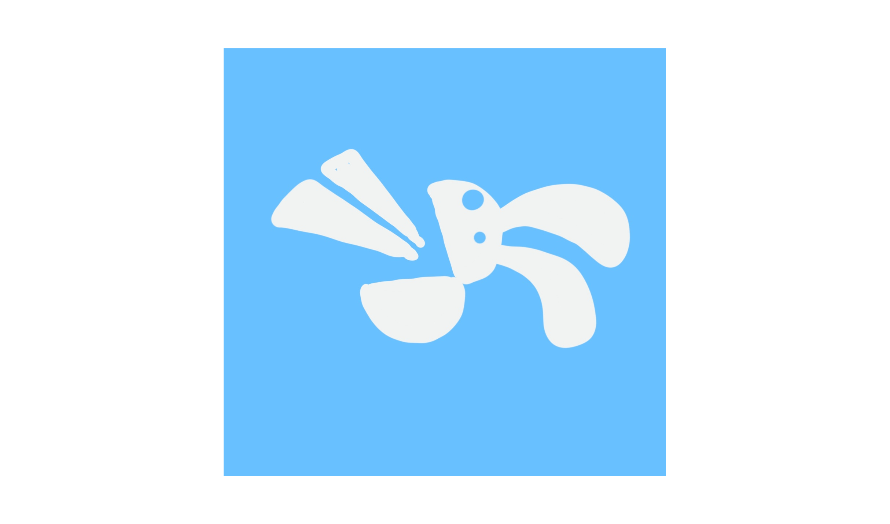

# OLGram

[@olgram](https://t.me/olgrambot) - конструктор ботов обратной связи в Telegram

[](https://github.com/civsocit/olgram/actions?workflow=Linter) 
[](https://github.com/civsocit/olgram/actions?workflow=Deploy)



## Возможности и преимущества Olgram Bot

* **Общение с клиентами**. После подключения бота, вы сможете общаться с вашими пользователями бота через диалог с 
ботом, либо подключенный отдельно чат, где может находиться ваш колл-центр.
* **Все типы сообщений**. Livegram боты поддерживают все типы сообщений — текст, фото, видео, голосовые сообщения и 
стикеры.
* **Open-source**. В отличие от известного проекта Livegram код нашего конструктора полностью открыт.
* **Self-hosted**. Вы можете развернуть свой собственный конструктор, если не доверяете нашему.
* **Безопасность**. В отличие от Livegram, мы не храним сообщения, которые вы отправляете в бот. А наши сервера 
располагаются в Германии, что делает проект неподконтрольным российским властям. 


По любым вопросам, связанным с Olgram, пишите в наш бот обратной связи 
[@civsocit_feedback_bot](https://t.me/civsocit_feedback_bot)

### Для разработчиков: сборка и запуск проекта

Вам потребуется собственный VPS или любой хост со статическим адресом или доменом.
* Создайте файл .env по образцу example.env. Вам нужно заполнить переменные:
  * BOT_TOKEN - токен нового бота, получить у [@botfather](https://t.me/botfather)
  * POSTGRES_PASSWORD - любой случайный пароль
  * WEBHOOK_HOST - IP адрес или доменное имя сервера, на котором запускается проект
* Сохраните файл docker-compose.yaml и соберите его:
```
sudo docker-compose up -d
```

В docker-compose.yaml минимальная конфигурация. Для использования в серьёзных проектах мы советуем:
* Приобрести домен и настроить его на свой хост
* Наладить реверс-прокси и автоматическое обновление сертификатов - например, с помощью 
[Traefik](https://github.com/traefik/traefik)
* Скрыть IP сервера с помощью [Cloudflire](https://www.cloudflare.com), чтобы пользователи ботов не могли найти IP адрес 
хоста по Webhook бота.

Пример более сложной конфигурации есть в файле docker-compose-full.yaml
