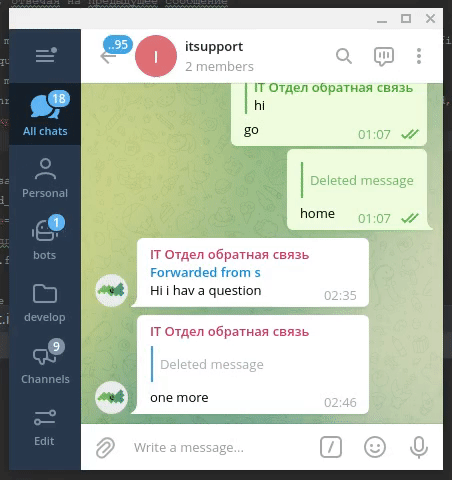

Опции
=============

.. _threads:

Потоки сообщений
----------------

Olgram пересылает сообщения так, чтобы сообщения от одного и того же пользователя оставались в одном и том же
потоке сообщений. Тогда по кнопке View Replies можно увидеть диалог с этим пользователем, а все остальные сообщения из
чата скрываются:

**Как настроить потоки сообщений**

Привяжите вашего feedback бота к групповому чату :doc:`quick_start`. В настройках группового чата откройте историю
чата для новых участников чата ("Chat history for new members -> Visible"). Изменение этой настройки превращает чат в
`супергруппу <https://telegram.org/blog/supergroups5k>`_: потоки сообщений работают только в таких группах

Включите потоки в настройках бота Olgram Опции->Потоки сообщений

.. _user_info:

Данные пользователя
-------------------

При получении входящего сообщения Olgram может пересылать дополнительную информацию об отправителе. Имя, username и
идентификатор пользователя. Например так:

.. image:: ../images/user_info.jpg
   :width: 300

Эта функция может быть полезной, чтобы отличить одного пользователя от другого. Имя и username можно сменить, но
идентификатор #id остаётся неизменным для одного и того же аккаунта.

Включить эту функцию можно в настройках бота Olgram Опции->Данные пользователя

.. note::

   Включение этой опции меняет текст политики конфиденциальности вашего feedback бота (команда /security_policy)
   и может отпугнуть некоторых пользователей. Не включайте эту опцию без необходимости.

.. _antiflood:

Защита от флуда
---------------

При включении этой опции пользователю запрещается отправлять больше одного сообщения в минуту. Используйте её, если
не успеваете обрабатывать входящие сообщения.
